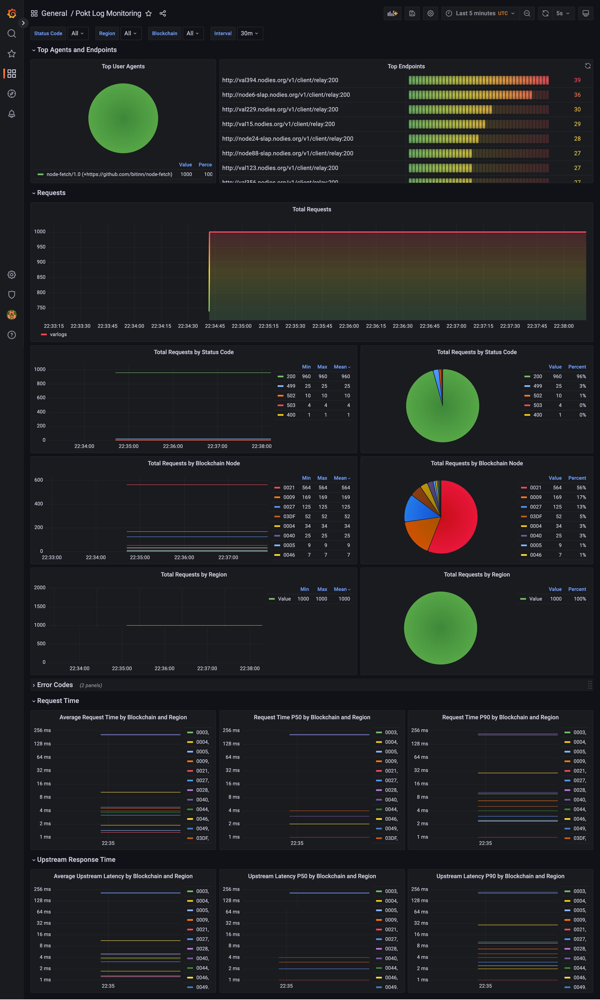
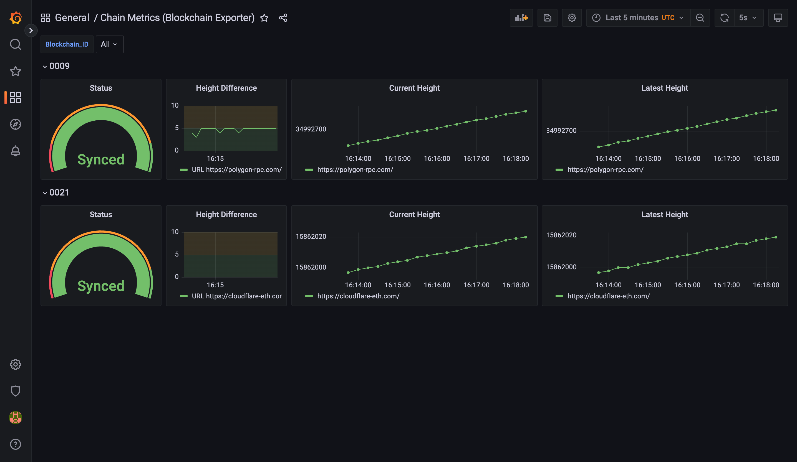
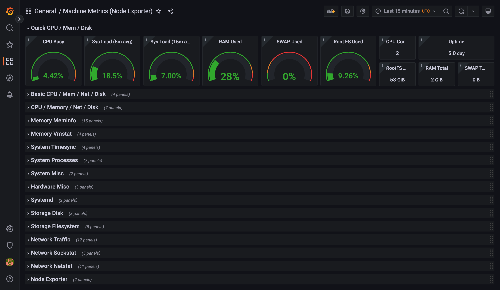

# Nodies Monitoring

Nodies Monitoring is a customizable and extensible monitoring solution for monitoring host machine metrics, container metrics, node status and node logs. 

Our project is split into a server (monitoring) stack, and a client (exporter) stack.

Please see [architecture documentation](./architecture.md) for a deeper analysis of the server/client stack.

## Want to Contribute?
TBD instructions on how to contribute to this project.

## Table of content

- [Installation](#installation)
    - [Dependencies](#dependencies)
- [Getting started](#getting-started)
    - [Settings](#settings-required)
    - [Server Setup](#server-setup)
    - [Client Setup](#client-setup)
    - [Run Individual Clients](#run-individual-clients)
- [Customization](#customization)
    - [Datasources](#datasources)
    - [Dashboards](#dashboards)
    - [Alerts](#alerts)
- [Links/Contact](#linkscontact)

## Installation

**NOTE:** These dependencies are required on both the server and client stack.

**Note:** Tested and recommended installation on Ubuntu 22.04.1 LTS host OS

### Dependencies

<details>
<summary>Python</summary>

<a href="https://www.python.org/downloads/release/python-3106/">Python 3.10.6</a>

</details>

<details>
<summary>Docker</summary>

Uninstall existing docker
```bash
sudo apt-get remove docker docker-engine docker.io containerd runc
```

Install required packages
```bash
sudo apt-get update
sudo apt-get install \
    ca-certificates \
    curl \
    gnupg \
    lsb-release
```

Add docker official GPG key
```bash
sudo mkdir -p /etc/apt/keyrings
curl -fsSL https://download.docker.com/linux/ubuntu/gpg | sudo gpg --dearmor -o /etc/apt/keyrings/docker.gpg
```

Setup docker repo
```bash
echo \
  "deb [arch=$(dpkg --print-architecture) signed-by=/etc/apt/keyrings/docker.gpg] https://download.docker.com/linux/ubuntu \
  $(lsb_release -cs) stable" | sudo tee /etc/apt/sources.list.d/docker.list > /dev/null
```

Update apt package index
```bash
sudo apt-get update
```

Install latest docker
```bash
sudo apt-get install docker-ce docker-ce-cli containerd.io docker-compose-plugin
```
</details>

Clone the repository
```bash
sudo git clone https://github.com/baaspoolsllc/nodies_monitoring.git
```
Change the current working directory to the cloned repository
```bash
cd nodies_monitoring
```
Install python3-pip
```bash
apt install python3-pip
```

Install requirements
```bash
pip3 install -r requirements.txt
```

## Getting Started

### Configuration Setup (REQUIRED)

**NOTE:** This step is required on both the server and the client stack. When setting up this stack, you should follow the principles of least privilege when allowing users to access your exposed ports by setting up network or host based firewalls.

1. Run `sudo python3 setup.py` to generate a template `settings.yml.new` file.
2. Update `clients.promtail.loki_endpoint` with the ip address of the host that will run the [monitoring stack](./server) (loki, grafana, minio, prometheus, alertmanager)
3. Update `server.prometheus.exporter_endpoint` with the endpoints any services of the [exporter_stack](./clients) (blockchain_exporter, cadvisor, node_exporter, promtail)
4. Update `server.alerts.contactpoints` with the contact points of your alert recievers to send grafana-managed alerts to.
5. Update `clients.promtail.log_root_path` with the root path of your nginx logs.
6. Rename `settings.yml.new` to `settings.yml`

---

### Server setup 

On your monitoring server:

1. Run [setup.py](setup.py) again to save your configurations and set folder permissions.
```bash
sudo python3 setup.py
```
2. Edit the `settings.yml.new` file
```bash
sudo vi settings.yml.new
```
3. Rename the file `settings.yml.new` to `settings.yml`
```bash
sudo mv settings.yml.new settings.yml
```
4. Create the `chains.json` file - Mandatory
```bash
echo "[]" > clients/bcexporter/config/chains.json
```
5. Execute the [setup.py](setup.py) once again
```bash
sudo python3 setup.py
```
6. Change directory into the [server](./server) subfolder, and boot up all server services
```bash
cd server && docker compose up -d
```
7. Launch a browser and navigate to `http://<host>:<port> e.g http://192.168.1.2:3000
    Default username and password for Grafana is `admin:admin`
**NOTE:** Sudo is required here to set some folder permissions

----

### Client setup

On your exporter server:

#### Blockchain exporter setup

1. Include your blockchain accessible endpoints inside a `chains.json` (./templates/chains.json) file. An example file is provided for you in `chains.example.json`.

#### Log aggregation setup (Promtail)
2. Ensure that your [access logs](https://docs.nginx.com/nginx/admin-guide/monitoring/logging/) are formatted with the following format:
```
    log_format json_combined escape=json
    '{'
        '"region":"us-east-1",'
        '"time_local":"$time_local",'
        '"request":"$scheme://$host$request_uri",'
        '"method":"$request_method",'
        '"protocol":"$server_protocol",'
        '"status":"$status",'
        '"request_body":"$request_body",'
        '"body_bytes_sent":"$body_bytes_sent",'
        '"http_referrer":"$http_referer",'
        '"http_user_agent":"$http_user_agent",'
        '"upstream_addr":"$upstream_addr",'
        '"upstream_status":"$upstream_status",'
        '"remote_addr":"$remote_addr",'
        '"remote_user":"$remote_user",'
        '"upstream_response_time":"$upstream_response_time",'
        '"upstream_connect_time":"$upstream_connect_time",'
        '"upstream_header_time":"$upstream_header_time",'
        '"request_time":"$request_time"'
    '}';
```
Note: Replace the `region` value with a unique region identifer, i.e `us-east-1`, `eu-central-1`, etc based off where your nginx server is located.

3. Run [setup.py](setup.py) again to save your configurations and set folder permissions.
```bash
sudo python3 setup.py
```
4. Edit the `settings.yml.new` file
```bash
sudo vi settings.yml.new
```
5. Rename the file `settings.yml.new` to `settings.yml`
```bash
sudo mv settings.yml.new settings.yml
```
6. Create the `chains.json` file - Mandatory
```bash
echo "[]" > clients/bcexporter/config/chains.json
```
5. Execute the [setup.py](setup.py) once again
```bash
sudo python3 setup.py
```
6. Modify `clients.promtail.log_root_path` in the `settings.yml` file to reflect your nginx log directory
7. Change directory into the [clients](./clients) subfolder, and boot up all client services
```bash
cd nodies_monitoring/server && docker compose up -d
```
**NOTE:** Sudo is required here to set some folder permissions

----

### Run individual clients
 [setup.py](setup.py) has an optional CLI flag that allows control over which clients are ran on the exporter stack. For example, if you don't want to run log aggregation, then you can disable the log shipper `promtail`.

`sudo python3 setup.py --clients blockchain_exporter cadvisor node_exporter`

---

## Customization

### Datasources

Default datasources have been provisioned in [./templates/datasources](./templates/datasources)

To add additional datasources, please refer to [grafana datasource documentation](https://grafana.com/docs/grafana/latest/administration/provisioning/#data-sources)

### Dashboards

Default dashboards have been provisioned in [./server/grafana/dashboards](./server/grafana/dashboards)

To add additional dashboards, please refer to [grafana dashboard documentation](https://grafana.com/docs/grafana/latest/administration/provisioning/#dashboards)

### Alerts

Default alerting has been provisioned in [./server/grafana_provisioning/alerting](./server/grafana_provisioning/alerting)

To add additional alerting, please refer to [grafana alerting documentation](https://grafana.com/docs/grafana/latest/administration/provisioning/#alerting)

## Links/Contact

For any inquiries, please reach out to PoktBlade(PoktBlade#5970) or poktdachi(dachi#0005) on the pokt discord

[](https://discord.gg/pokt)

#### Pokt Log




#### Chain Metrics




#### Machine Metrics



#### Container Metrics


