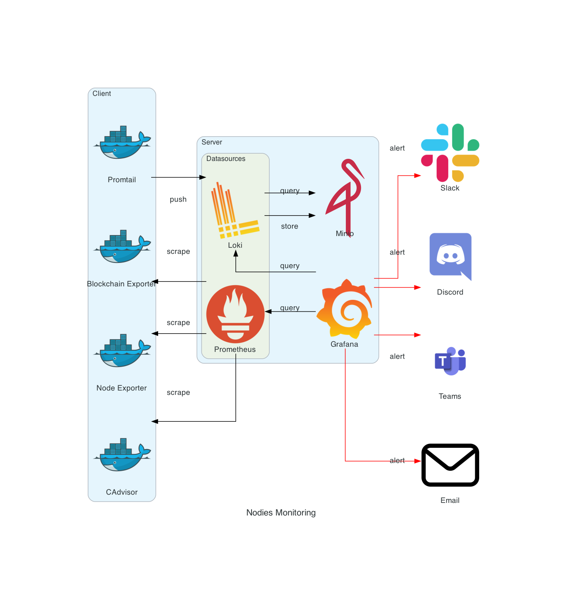

# Architecture

The server stack includes:

| Service    | Description              |
|------------|--------------------------|
| Grafana    | Analytics and Monitoring |
| Minio      | Object Storage           |
| Loki       | Log Aggregation          |
| Prometheus | Time Series Aggregation  |

The client stack can include:

| Service             | Description        |
|---------------------|--------------------|
| Blockchain Exporter | Blockchain Metrics |
| Node Exporter       | Machine Metrics    |
| CAdvisor            | Container Metrics  |
| Promtail            | Log Shipper        |

## Diagram

